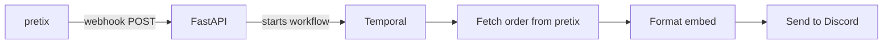

# pretix-discord

Middleware that listens for [pretix](https://pretix.eu) webhook notifications and posts formatted order summaries to a Discord channel via webhook.

When a new order is placed in pretix, this service:

1. Receives the webhook POST from pretix
2. Fetches the full order details from the pretix REST API
3. Formats a Discord embed with order code, total, buyer email, and purchased products
4. Sends the embed to a Discord channel via webhook

The pipeline is orchestrated by [Temporal](https://temporal.io), which provides automatic retries and durable execution. If Discord is temporarily unavailable, the notification is delivered when it recovers.

## Architecture



**Services** (all run via Docker Compose):

| Service    | Description                                      |
|------------|--------------------------------------------------|
| `caddy`    | Reverse proxy, automatic HTTPS via Let's Encrypt |
| `temporal` | Temporal dev server with persistent SQLite       |
| `worker`   | Temporal worker executing activities             |
| `web`      | FastAPI app receiving pretix webhooks             |

**Source layout:**

```
src/pretix_discord/
├── api.py                 # FastAPI app (POST /webhook, GET /health)
├── config.py              # Settings loaded from environment variables
├── discord_activities.py  # Format embed, send Discord webhook
├── main.py                # FastAPI/uvicorn entrypoint
├── models.py              # All dataclasses (orders, embeds, inputs)
├── pretix_activities.py   # Fetch and parse pretix orders
├── worker.py              # Temporal worker entrypoint
└── workflow.py            # Workflow: fetch -> format -> send
```

## Prerequisites

- A server with [Docker](https://docs.docker.com/engine/install/) installed
- A domain name pointed at the server (for HTTPS)
- A pretix API token ([docs](https://docs.pretix.eu/api/tokenauth.html))
- A Discord webhook URL ([docs](https://support.discord.com/hc/en-us/articles/228383668-Intro-to-Webhooks))

## Configuration

Copy the example environment file and fill in your values:

```bash
cp .env.example .env
```

### Required variables

| Variable              | Description                                      |
|-----------------------|--------------------------------------------------|
| `PRETIX_API_TOKEN`    | API token from your pretix organizer account     |
| `DISCORD_WEBHOOK_URL` | Full Discord webhook URL for the target channel  |
| `DOMAIN`              | Public domain for this service (used by Caddy for TLS) |

### Optional variables

| Variable              | Default                    | Description                        |
|-----------------------|----------------------------|------------------------------------|
| `PRETIX_BASE_URL`     | `https://pretix.eu/api/v1` | pretix API base URL                |
| `TEMPORAL_ADDRESS`    | `temporal:7233`            | Temporal server address            |
| `TEMPORAL_NAMESPACE`  | `default`                  | Temporal namespace                 |
| `TEMPORAL_TASK_QUEUE` | `pretix-discord`           | Temporal task queue name           |

## Deployment

### 1. Provision a server

Any VPS with Docker works. On a fresh Ubuntu/Debian server:

```bash
curl -fsSL https://get.docker.com | sh
```

### 2. Clone and configure

```bash
git clone https://github.com/PyTexas/pretix-discord.git
cd pretix-discord
cp .env.example .env
# Edit .env with your values
```

### 3. Point DNS

Create an A record for your domain pointing to the server's IP address. Caddy needs this to provision the TLS certificate.

### 4. Start the services

```bash
docker compose up -d
```

Caddy will automatically obtain a Let's Encrypt certificate on the first request. The services will restart automatically if the server reboots.

### 5. Configure pretix

In your pretix organizer settings:

1. Go to **Settings > Webhooks**
2. Add a new webhook with the URL: `https://YOUR_DOMAIN/webhook`
3. Select the **Order placed** event
4. Save

### 6. Verify

Check that the service is running:

```bash
curl https://YOUR_DOMAIN/health
# {"status":"ok"}
```

Check the Temporal UI at `http://YOUR_SERVER_IP:8233` to monitor workflows.

## Local Development

### Requirements

- Python 3.13+
- [uv](https://docs.astral.sh/uv/)
- [just](https://github.com/casey/just)

### Setup

```bash
uv sync
```

### Running checks

```bash
just check
```

This runs formatting (ruff), tests (pytest), linting (ruff), and type checking (mypy strict).

### Individual targets

```bash
just fmt        # Format code
just test       # Run tests
just lint       # Lint code
just typecheck  # Type check (mypy --strict)
```

## Smoke Test

With Docker Compose running locally:

```bash
curl -X POST http://localhost:8000/webhook \
  -H "Content-Type: application/json" \
  -d '{
    "notification_id": 99999,
    "organizer": "your-organizer",
    "event": "your-event",
    "code": "XXXXX",
    "action": "pretix.event.order.placed"
  }'
```

The workflow will appear in the Temporal UI. If the order code is valid and your tokens are configured, a Discord message will appear in the target channel.

## Monitoring

- **Health check:** `GET /health` returns `{"status": "ok"}`
- **Temporal UI:** Port 8233 — view workflow history, retries, and failures
- **Docker logs:** `docker compose logs -f worker` to watch activity execution

## License

MIT
